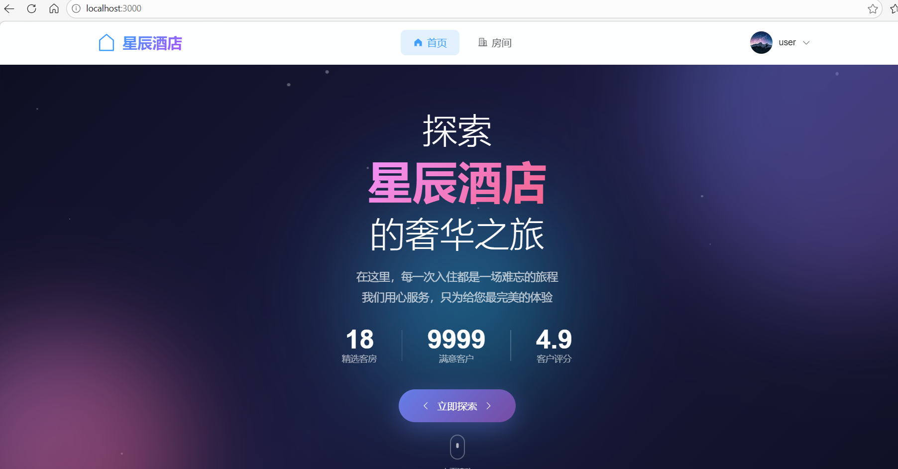
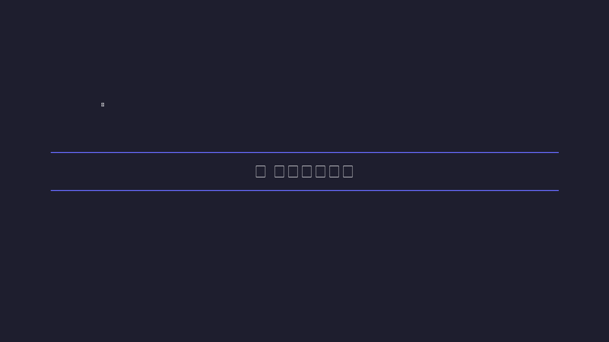
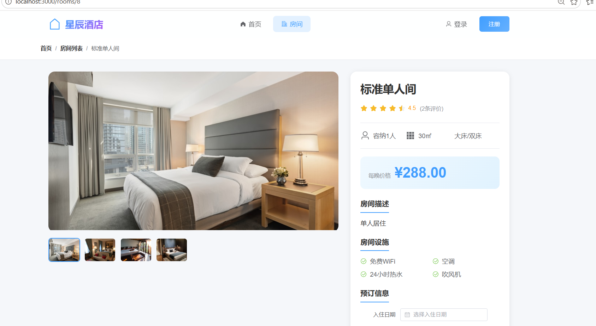
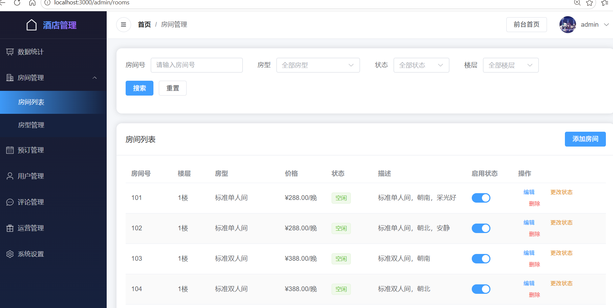

# 酒店管理系统

一个现代化的酒店管理系统平台，采用前后端分离架构开发。

## 项目截图

### 前台首页


### 前台登录


### 房间详情


### 后台管理 - 房间管理


## 技术栈

### 后端
- Python 3.9+
- Django 4.2
- Django REST Framework
- MySQL

### 前端
- Vue 3
- Vite 5
- Element Plus
- Pinia
- Vue Router

## 功能特性

### 前台用户系统
- 🏠 首页展示：轮播图、房型推荐、用户评价、促销活动
- 🛏️ 房间浏览：房型筛选、价格搜索、详情查看
- 📅 在线预订：日期选择、订单确认、支付流程
- 👤 用户中心：个人信息管理、预订记录查看
- ⭐ 我的收藏：收藏喜欢的房型
- 🔔 消息通知：系统消息、预订通知、促销通知

### 后台管理系统
- 📊 仪表盘：数据统计、图表展示、快捷操作
- 🏨 房间管理：房型管理、房间状态、批量操作
- 📋 预订管理：订单处理、入住办理、退房结算
- 👥 用户管理：用户列表、角色权限、状态管理
- 💬 评论管理：评论审核、内容管理
- 🏷️ 标签管理：标签增删改查、房型标签关联
- 🎁 运营管理：轮播图管理、促销活动、优惠券管理
- 📝 日志管理：操作日志、登录日志查询与导出
- ⚙️ 系统设置：系统信息、参数配置、数据备份

### UI/UX 特性
- ✨ 丰富的交互动效（页面过渡、悬停效果、表单验证）
- 🎨 现代化UI设计（渐变色彩、卡片布局、响应式设计）
- 📱 完全响应式布局，支持移动端访问

## 快速开始

### 环境要求
- Python 3.9+
- Node.js 18+
- MySQL 8.0+

### 手动启动

1. 启动后端服务:
```bash
cd backend
python -m venv venv
call venv\Scripts\activate  # Windows
pip install -r requirements.txt
python manage.py migrate
python init_data.py
python manage.py runserver
```

2. 启动前端服务:
```bash
cd frontend
npm install
npm run dev
```

## 演示账户

| 角色 | 用户名 | 密码 |
|------|--------|------|
| 管理员 | admin | admin123 |
| 客户 | user | user123 |

## 项目结构

```
hotel_system/
├── backend/                 # 后端项目
│   ├── apps/               # Django应用
│   │   ├── users/         # 用户管理
│   │   ├── rooms/         # 房间管理
│   │   ├── bookings/      # 预订管理
│   │   ├── reviews/       # 评论管理
│   │   ├── favorites/     # 收藏管理
│   │   ├── notifications/ # 消息通知
│   │   ├── tags/          # 标签管理
│   │   ├── operations/    # 运营管理
│   │   ├── logs/          # 日志管理
│   │   ├── payments/      # 支付管理
│   │   └── system/        # 系统设置
│   ├── config/            # 项目配置
│   ├── init_data.py       # 初始化数据脚本
│   └── requirements.txt   # Python依赖
├── frontend/               # 前端项目
│   ├── src/
│   │   ├── api/          # API接口
│   │   ├── layouts/      # 布局组件
│   │   ├── router/       # 路由配置
│   │   ├── stores/       # 状态管理
│   │   ├── styles/       # 样式文件
│   │   └── views/        # 页面组件
│   ├── package.json      # Node依赖
│   └── vite.config.js    # Vite配置
├── start.bat              # Windows快速启动脚本
├── start-full.bat         # Windows完整启动脚本(含环境检查)
├── stop.bat               # Windows停止服务脚本
├── start.sh               # Mac/Linux启动脚本
└── README.md              # 项目说明
```

## API接口

### 用户模块
- `POST /api/users/login/` - 用户登录
- `POST /api/users/logout/` - 用户退出
- `POST /api/users/register/` - 用户注册
- `GET /api/users/me/` - 获取当前用户信息

### 房间模块
- `GET /api/rooms/types/` - 获取房型列表
- `GET /api/rooms/` - 获取房间列表
- `GET /api/rooms/available/` - 获取可用房间

### 预订模块
- `GET /api/bookings/` - 获取预订列表
- `POST /api/bookings/` - 创建预订
- `POST /api/bookings/{id}/confirm/` - 确认预订
- `POST /api/bookings/{id}/check_in/` - 办理入住
- `POST /api/bookings/{id}/check_out/` - 办理退房

### 收藏模块
- `GET /api/favorites/` - 获取收藏列表
- `POST /api/favorites/` - 添加收藏
- `DELETE /api/favorites/{id}/` - 取消收藏
- `POST /api/favorites/toggle/` - 切换收藏状态

### 消息通知模块
- `GET /api/notifications/` - 获取消息列表
- `GET /api/notifications/unread_count/` - 获取未读数量
- `POST /api/notifications/mark_all_read/` - 全部标记已读

### 运营管理模块
- `GET /api/operations/banners/` - 轮播图管理
- `GET /api/operations/promotions/` - 促销活动管理
- `GET /api/operations/coupons/` - 优惠券管理

## 开发说明

### 数据库迁移
```bash
cd backend
python manage.py makemigrations
python manage.py migrate
```

### 创建管理员
```bash
cd backend
python manage.py createsuperuser
```

### 前端构建
```bash
cd frontend
npm run build
```

## 许可证

MIT License
